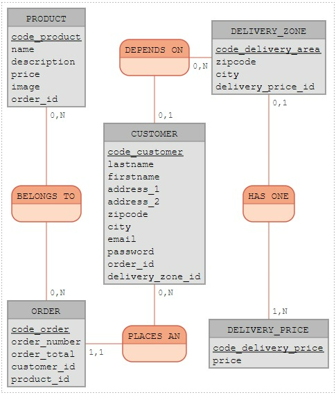

### API pour un site de vente en ligne de box de petit-dejeuner

-  Creation de la BDD avec systeme d'authentification des clients, inscription, commande en ligne avec multiples contraintes du au type de vente effectuees (livraison en local avec differents tarifs en fonction des codes postaux/villes)

## MCD



```
CUSTOMER: code_customer, lastname, firstname, address_1, address_2, zipcode, city, email, password, order_id, delivery_zone_id
PLACES AN, 11 ORDER, 0N CUSTOMER
ORDER: code_order, order_number, order_total, customer_id, product_id

DEPENDS ON, 01 CUSTOMER, 0N DELIVERY_ZONE
DELIVERY_ZONE: code_delivery_area, zipcode, city, delivery_price_id
BELONGS TO, 0N PRODUCT, ON ORDER

DELIVERY_PRICE: code_delivery_price, price
HAS ONE, 01 DELIVERY_ZONE, 1N DELIVERY_PRICE
PRODUCT: code_product, name, description, price, image, order_id
```

```
DELIVERY_ZONE ( code_delivery_area, zipcode, city, delivery_price_id, code_delivery_price )
PRODUCT ( code_product, name, description, price, image, order_id )
CUSTOMER ( code_customer, lastname, firstname, address_1, address_2, zipcode, city, order_id, delivery_zone_id, code_delivery_area )
DELIVERY_PRICE ( code_delivery_price, price, delivery_area_id )
ORDER ( code_order, order_number, customer_id, product_id, order_total, code_customer, code_product )
```
